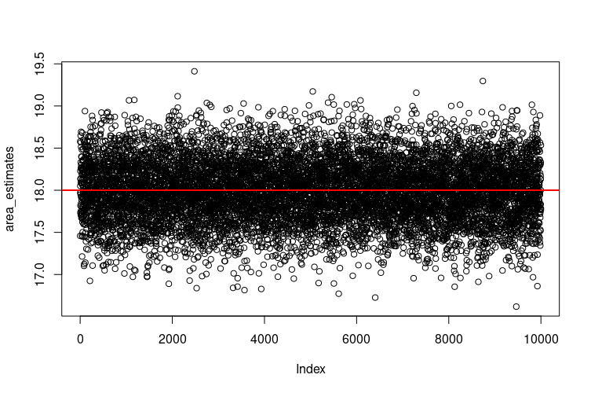

# Statistical Data Analysis
R examples

# README for Repository

## Overview

This repository contains various R scripts and corresponding visual outputs related to statistical analysis, mathematical functions, and data visualization. The repository is organized into different directories and files, each serving a specific purpose in exploring concepts such as probability distributions, regression, time series, and more.

## Key Files and Descriptions

### Images

- **add_noise.png**: Visual representation of adding noise to data.  
  

- **der_pde.png**: Visualization of the derivative of a partial differential equation.  
  

- **double_derivative.png**: Plot showcasing the double derivative of a function.  
  

- **ets_forecast.png**: Exponential Smoothing State Space Model forecast plot.  
  

- **3d_fun_plot.png**: 3D plot of a mathematical function.  
  

- **approx_over_nos.png**: Approximation over numbers visualization.  
  

- **binomb_dist.png**: Binomial distribution plot.  
  

- **exponential_funtion.png**: Visualization of an exponential function.  
  

- **fn_gn_O(n).png**: Comparison of functions showing O(n) complexity.  
  .png)

- **function_area.png**: Visualization of the area under a curve for a given function.  
  

- **par_mfrow.png**: Demonstration of using `par(mfrow)` to create multiple plots.  
  

- **runif_rnorm_plot.png**: Plot of uniform and normal distributions.  
  

- **ggplot.png**: Example of a plot created using ggplot2 in R.  
  

- **kings_death.png**: Time series plot of Kings' deaths.  
  

- **1D_plot.png**: 1D plot example for linear algebra concepts.  
  

- **2D_plot.png**: 2D plot example for linear algebra concepts.  
  

- **plot_vector.png**: Visualization of a vector in 2D space.  
  

- **map_world.png**: World map visualization.  
  

- **unemp_chloro.png**: Choropleth map showcasing unemployment rates.  
  

- **pnorm_qnorm_dnorm.png**: Plot demonstrating the `pnorm`, `qnorm`, and `dnorm` functions.  
  

- **pnorm_qnorm_rnorm_dnorm.png**: Expanded version of the previous plot with additional `rnorm` function.  
  

- **freq_plot.png**: Frequency plot demonstrating probability concepts.  
  

- **prob.png**: Visualization of basic probability distribution.  
  

- **rnormLine.png**: Line plot of random normal distribution data.  
  

- **rnorm_plot.png**: Histogram plot of random normal distribution data.  
  

- **sin_cos_3d.png**: 3D plot of sine and cosine functions.  
  

- **sin_cos.png**: 2D plot of sine and cosine functions.  
  

- **sine.png**: Basic sine wave plot.  
  

- **sin_using_makeFun.png**: Sine function plot generated using a custom function.  
  

### Scripts

- **airQuality_covidData.R**: Analysis of air quality data during the COVID-19 pandemic.
- **calculate_distance.R**: Script to calculate distances between points.
- **Chapter4_Sampling_and_Distributions.R**: Examples and exercises related to sampling and distributions.
- **complex_no.R**: Operations and visualizations involving complex numbers.
- **derivative.R**: Code for calculating and visualizing derivatives.
- **der_pde.R**: Implementation of partial differential equation derivatives.
- **dnorm_pnorm_qnorm.R**: Functions and plots related to normal distributions.
- **dplyr.R**: Examples using the dplyr package for data manipulation.
- **ets_forecast.R**: Implementation of Exponential Smoothing State Space Model for forecasting.
- **3d_fun_plot.R**: Script for generating 3D function plots.
- **algorithm_complextiy_O_1.R**: Examples demonstrating algorithmic complexity, specifically O(1).
- **anova.R**: Analysis of variance (ANOVA) implementation.
- **binomial_distribution.R**: Implementation of binomial distribution and related visualizations.
- **exponential_fun.R**: Script for working with exponential functions.
- **markov_chain.R**: Implementation and visualization of Markov chains.
- **mean_median_mode_Sd_IQR.R**: Calculation of central tendency and spread measures.
- **monte_carlo_integration_area_approx.R**: Monte Carlo method for approximating area under a curve.
- **par_mfrow.R**: Example of creating multiple plots in one figure using `par(mfrow)`.
- **runif_rnorm.R**: Generation of random uniform and normal distributions.
- **t-test.R**: Implementation of t-tests.
- **visualize.R**: General-purpose script for creating visualizations.
- **ggplot.R**: Examples of plots created using ggplot2.
- **hist1.R**: Histogram plot creation.
- **hist2.R**: Additional histogram plotting examples.
- **house_price_material.R**: Analysis of house prices based on material data.
- **houseprice.R**: General house price analysis.
- **kings_uk_ts.R**: Time series analysis of UK kings' deaths.
- **1D_2D_plot.R**: Linear algebra examples for 1D and 2D plots.
- **dimensions.R**: Visualization of dimensions in linear algebra.
- **matrix_mul.R**: Matrix multiplication examples and visualizations.
- **vector_plot.R**: Visualization of vectors in space.
- **logistic_regression.R**: Implementation of logistic regression.
- **maps.R**: Scripts for generating maps and spatial data visualizations.
- **normal_dist.R**: Examples related to the normal distribution.
- **pasword_analysis.R**: Analysis of password strengths.
- **pipe_operator.R**: Examples of using the pipe operator in R.
- **R-inla.R**: Integrated Nested Laplace Approximations (INLA) implementation.
- **sinCos.R**: Plotting sine and cosine functions.
- **sin.R**: Basic sine function plotting.
- **trapz.R**: Implementation of trapezoidal rule for numerical integration.
- **ts.R**: Time series analysis and visualization.

## How to Use

Each script can be executed in R, and the corresponding images provide visual representations of the data or mathematical concepts being explored. The repository is ideal for learning and reference purposes for topics related to statistics, linear algebra, and data visualization in R.
